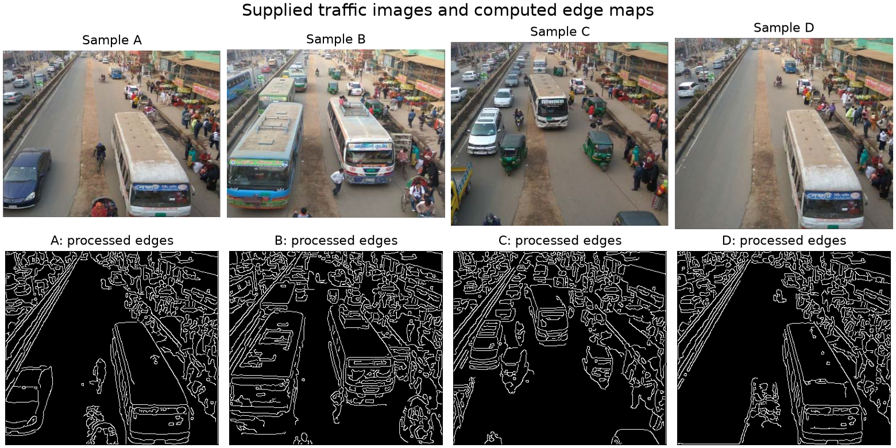

# Density-Based Smart Traffic Control System

An academic Python desktop demo that compares traffic-image edge density with a reference image and suggests a green-signal duration. It uses a custom Canny pipeline with Gaussian smoothing, Sobel gradients, non-maximum suppression, thresholding, and connected-edge hysteresis.

**Author:** Nava Chaitanya Karella · **Academic project:** Jan 2024 - Oct 2025

The original project was completed in October 2025. This portfolio maintenance update adds reproducible setup, supplied images, error handling, and automated tests. It does not imply these improvements were present in the original submission.



## Quick start

Tested with Python 3.12 on Windows. Install Python with Tkinter support (included in the standard Windows Python installer).

```powershell
python -m venv .venv
.venv\Scripts\python -m pip install -r requirements.txt
.venv\Scripts\python Main.py
```

On macOS/Linux, use `.venv/bin/python` instead. Linux may require your distribution's `python3-tk` package. Those platforms have not been tested.

Windows users can also double-click `run.bat` after installing the dependencies. Paths are relative to the application files, so launch location does not matter.

## Desktop workflow

1. Select a traffic image (start with `images/A.png`).
2. Keep the supplied `images/refrence.png` reference or choose another original image.
3. Select **Analyze image**. The interface reports sample/reference edge counts, the edge-density ratio, and the suggested duration.
4. Select **Show edge comparison** to view both computed edge maps.

Both images receive identical processing. Samples are resized to the reference dimensions before comparison. Image analysis runs in a worker thread so the window remains responsive. The app rejects missing/corrupt images and references without detectable edges.

## Run the sample analysis and tests

```powershell
.venv\Scripts\python test_script.py
.venv\Scripts\python -m pip install -r requirements-dev.txt
.venv\Scripts\python -m pytest test_traffic.py -q
```

The sample script processes A-D and writes edge images plus `results.csv` into `outputs/`. Use `--output PATH` or `--reference PATH` to change those locations. The supplied legacy `gray/` files are not required: reference edges are recalculated from the original image.

## Verified results

On the supplied images with the default reference:

| Sample | Edge pixels | Reference edge pixels | Ratio | Suggested green time |
| --- | ---: | ---: | ---: | ---: |
| A | 12,760 | 14,702 | 86.791% | 50 s |
| B | 15,359 | 14,702 | 104.469% | 60 s |
| C | 12,997 | 14,702 | 88.403% | 50 s |
| D | 12,730 | 14,702 | 86.587% | 50 s |

**24 automated tests passed.** Tests cover timing boundaries, invalid ratios, uniform images, connected weak-edge chains in both directions, repeated detector calls, missing/corrupt files, blank references, all supplied inputs, and importing the interface without opening a window. The processing path and tests were executed; interactive desktop clicks have not been manually verified.

These results are reproducibility checks, not an accuracy benchmark. A ratio above 100% is possible because a sample can have more edge pixels than the reference.

## Timing rule

`ratio = sample edge pixels / reference edge pixels * 100`

| Ratio | Seconds |
| --- | ---: |
| 90% or more | 60 |
| Above 85%, below 90% | 50 |
| Above 75%, up to 85% | 40 |
| Above 50%, up to 75% | 30 |
| Up to 50% | 20 |

This is an edge-density heuristic, not an exact vehicle count or validated occupancy percentage. Shadows, lane markings, camera position, reference choice, and resizing affect the result. The demo does not connect to traffic lights or establish safe signal timings for real roads.

## File guide

- `Main.py`: desktop interface and asynchronous processing.
- `traffic.py`: image reading, normalization, analysis, and timing rules.
- `CannyEdgeDetector.py`: custom edge detector, including modern SciPy imports and stable blank-image handling.
- `test_script.py`: reproducible batch analysis and CSV export.
- `test_traffic.py`: regression tests.
- `test1_module.py`: compatibility adapter replacing the original unfinished detector placeholder.
- `images/`: original supplied traffic and reference images. The original `refrence.png` spelling is retained for compatibility.
- `requirements.txt`, `requirements-dev.txt`: exact tested direct dependency versions.

## Future work

- Evaluate against annotated vehicle counts and a larger, consistently captured dataset.
- Compare this edge-based baseline with object detection.
- Add a region-of-interest selector and quantify sensitivity to illumination and resizing.

## Contact

[GitHub profile](https://github.com/nava7227) · [LinkedIn](https://www.linkedin.com/in/navakarella0027/)
